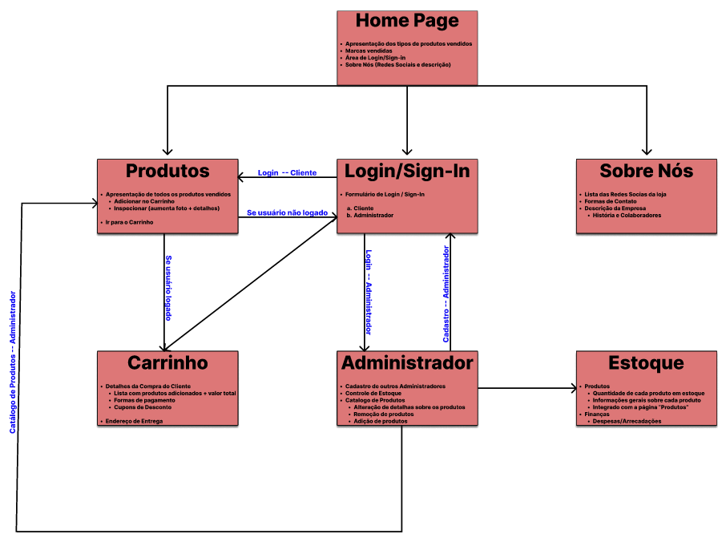
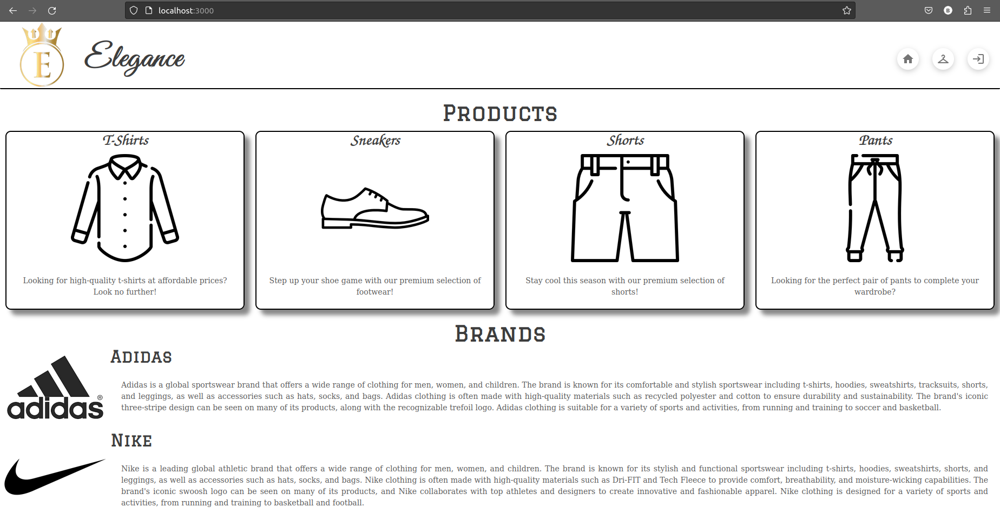
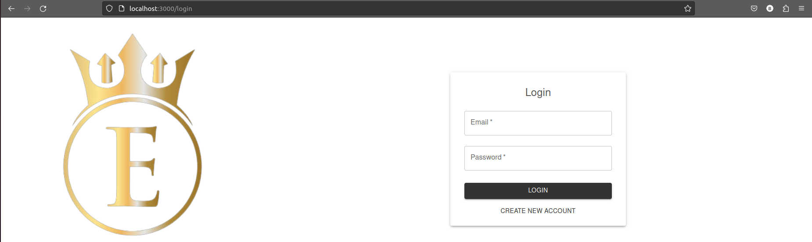
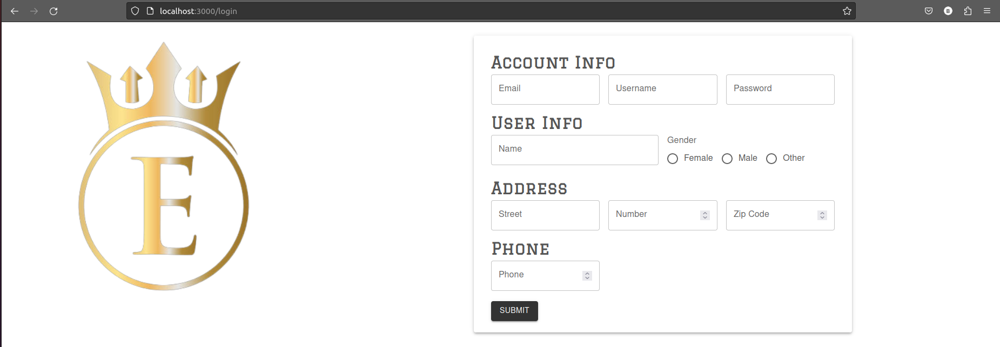
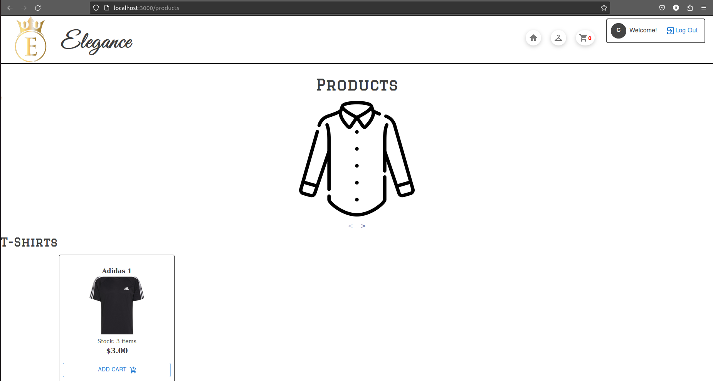
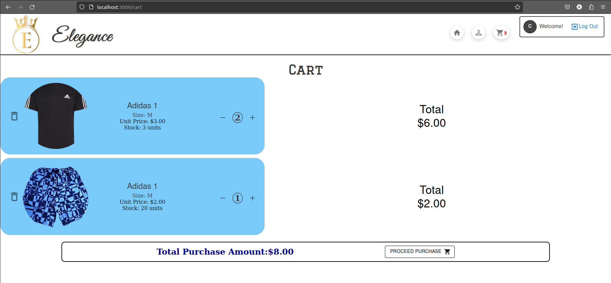
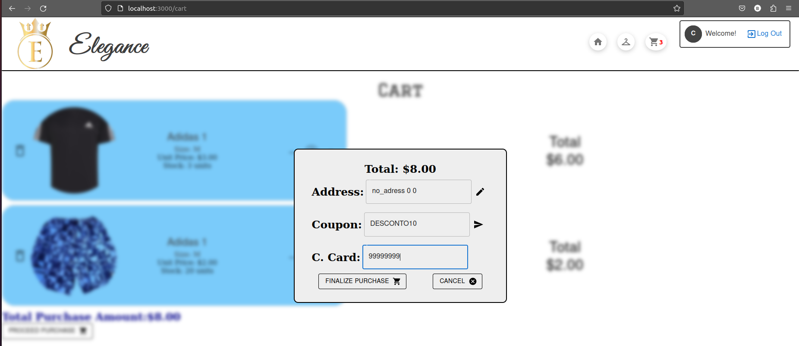
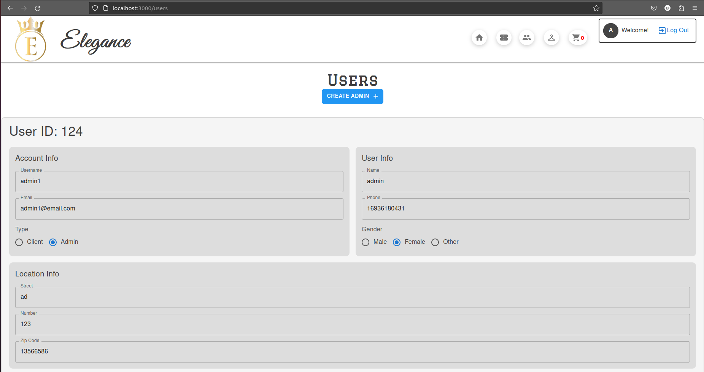
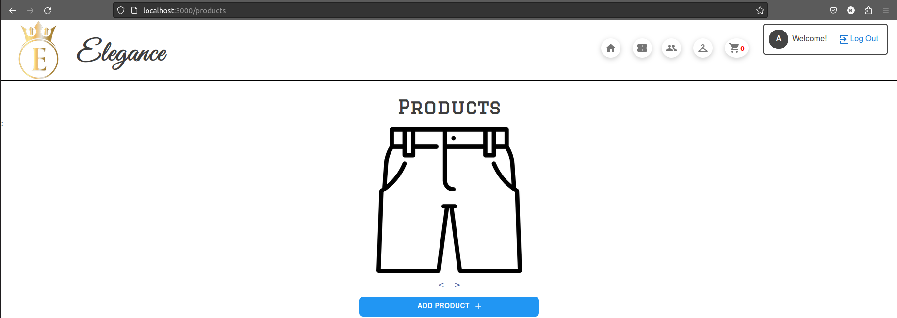

# Relatório do Projeto

### Integrantes

|          Nome           |   NUSP   |
| :---------------------: | :------: |
|    Jorge Luiz Franco    | 13695091 |
|     Breno Rodrigues     | 11734142 |
| Gustavo Hitomi da Silva | 11801202 |

### Requisitos

O sistema deve ter 2 tipos de usuários: Clientes e Administradores.

1. Os Administradores são responsáveis pelo registro/gerenciamento de usuários, clientes e produtos/serviços fornecidos. A aplicação já vem com uma conta admin com senha admin.
2. Os clientes são usuários que acessam o sistema para comprar produtos/serviços.
3. O registro do administrador inclui, no mínimo: nome, id, telefone, e-mail.
4. Cada registro de cliente inclui, no mínimo: nome, id, endereço, telefone, e-mail.
5. Os registros de produtos/serviços incluem, no mínimo: nome, id, foto, descrição, preço, quantidade (em estoque) e quantidade vendida.
6. Sua loja pode vender produtos, serviços ou ambos (você decide).
7. Venda de produtos (ou serviços): Os produtos são selecionados, a quantidade escolhida e são incluídos em um carrinho. Os produtos são comprados usando um número de cartão de crédito (qualquer número é aceito pelo sistema). A quantidade de produtos vendidos é subtraída ao montante de estoque e adicionada ao montante dos vendidos.
8. Gestão de Produtos/Serviços: Os administradores podem criar/atualizar/ler/excluir (crud) novos produtos e serviços. Por exemplo, eles podem alterar a quantidade em estoque.
9. Para complementar os requisitos propostos pela disciplina, nosso projeto implementará cupons de desconto: assim, pretendemos que o servidor gere certa quantia de cupons de desconto (ID's) de maneira que, caso o usuário utilize um desses ID's gerados, o valor final do pagamento será decrescido por certa quantidade.
10. O sistema deve ser acessível e oferecer boa usabilidade. O sistema deve ser responsivo, o que significa que deve completar as tarefas atribuídas dentro de um tempo razoável.

### Descrição

Conforme descrito em "Requisitos", dois tipos de usuários poderão fazer uso da aplicação WEB: clientes e administradores. Sendo assim, a forma com a qual o usuário interage com as telas será diferente de acordo com o tipo de usuário. Por exemplo, ao se acessar a tela "Produtos" (falaremos dela mais a frente) como cliente, será possível navegar pelos produtos, inspecionando-os e adicionando-os no carrinho caso desejado. Por outro lado, ao acessar a tela "Produtos" como administrador, outros recursos estarão disponíveis, como a alteração de catálogo, alteração de detalhes dos produtos, e assim por diante. A Figura a seguir resume nossa aplicação e as diferentes maneiras com as quais será possível interagir com as telas:

_Figura 1: Fluxograma da aplicação._

Seguindo a ideia geral do fluxograma, as telas _Home-Page_, _Login/Signin_ e _Produtos_ foram projetadas:

- **_Home-Page_**: tela inicial da nossa aplicação. Contém uma barra de navegação interativa capaz de realizar redirecionamentos para todas as telas existentes (exceto "Administrador" e "Estoque", as quais são exclusivas para administradores), uma seção Produtos, a qual apresenta as informações gerais dos tipos de produtos oferecidos pela loja, permitindo redirecionamento às partes específicas da tela "Produtos" correspondentes a cada tipo de produto. A Figura 2 mostra situação atual da página em questão:

_Figura 2: Home-Page da apliação._

- **_Login/Signin_**: tela minimalista que contém o necessário para o usuário realizar a operação de login e signin na aplicação. Inicialmente, o usuário se depara com os campos necessários para o _Login_ (_email_ e senha), um botão para realizar o _Login_ e outro para cadastrar um novo usuário, conforme visto na Figura 3:

_Figura 3: Página de Login da aplicação._

Ao se clicar no botão "Create New Account", uma nova tela surge "acima" da tela anterior, contendo os campos necessários para o signin (nome, email, endereço, telefone, data de nascimento e senha) e um botão de submissão, conforme visto na Figura 4:

_Figura 4: Tela de Signin sobreposta a tela de Login._

- **Produtos**: página lista produtos ordenados por tipo e seus respectivos preços. Há um slider que permite pular para uma sessão específica se o cliente assim desejar.

- **Carrinho**: Nesta tela, o usuário é capaz de visualizar a lista de produtos previamente adicionados ao carrinho, além de alterar a quantidade de produtos e remover itens do mesmo. Dessa forma, a página também oferece o custo de cada produto ($c_i = q_i . p_i$, onde $i$ é o produto, $q_i$ é a quantidade de produtos e $p_i$ é o preço unitário do produto) e o custo total da compra ($c_t = \sum c_i$, onde $c_t$ é o custo total). Assim, o usuário pode finalizar a sua compra através do botão _Proceed Purchase_, como pode ser visto na Figura 5:

_Figura 5: Tela do carrinho da aplicação._

Clicando no botão _Proceed Purchase_, uma aba se abre permitindo a finalização da compra, como mostrado na Figura 6:

_Figura 6: Aba sobreposta a tela do carrinho, para finalização da compra_

Neste momento, será possível para o usuário indicar o número do cartão de crédito a ser utilizado e se há algum cupom de desconto a ser aplicado. O endereço de entrega será aquele cadastrado pelo usuário na hora do _Sign In_

- **Administrador**: Nesta tela o usuário administrador poderá adicionar novos administradores, gerenciar produtos e verificar as finanças.

  
  _Figura 7: Tela principal do administrador com os menus de acesso as funcionalidades da plataforma_

- **Estoque**: Nesta tela o usuário administrador poderá adicionar novos produtos, editar os produtos existentes e checar as quantidades e vendas de cada produto

  
  _Figura 8: Tela do estoque_

### Comentarios Sobre o Código

- Para facilitar o reuso do código, foram criados componemtes na pasta de components.

### Plano de Testes

Os testes a serem implementados são:

- Testar as barras de navegação.
- Visualizar a página de produtos como visitante (sem login)
- Registrar novo usuário / Criar conta
- Adicionar e remover os itens do carrinho
- Finalizar compra
- Criar cupom de desconto
- Testar os cupons de desconto
- Fazer login como administrador/cliente e verificar suas telas.
- Editar usuários (promover usuário)
- Verificar se após um compra/venda o estoque se altera
- Adicionar um novo produto
  - OBS: para adicionar a imagem ao produto, você deve colocar a imagem na pasta [src/assets/Produtos](../milestone3/src/assets/Produtos), e colocar o nome_da_imagem.png no campo _image name_
- Remover algum produto
- Tentar comprar um produto com maior quantidade que o estoque
- Verificar se quando um produto acaba no estoque, ele é removido

### Resultado dos Testes

Por enquanto todos os testes foram feitos de forma manual na nossa aplicação.

### Como rodar?

No diretório Milestone3 usar os seguintes comandos:

`npm install`

`npm start`

Existem 2 usuários previamente cadastrados:

Administrador: 
- Email: admin_teste@email.com Senha: admin

Cliente:
- Email: cliente_teste@email.com Senha: cliente

### Problemas Encontrados

- Deixar a página responsiva
- Problemas com o banco de dados

### Comentarios

Sem comentários até o momento.
